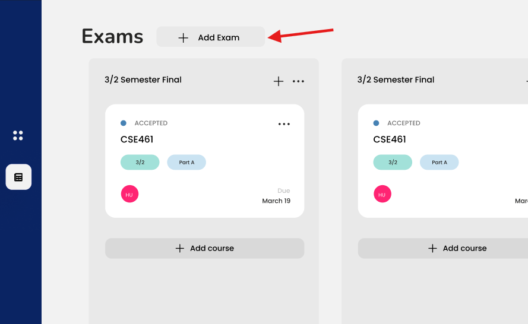

# PaperWatch

PaperWatch is a web-based application developed for tracking the status of exam papers online. This system is designed specifically for the CSE350 course to facilitate the process of managing and monitoring exam papers handled by teachers and overseen by the chief exam controller.

## Features

- **Assignment of Exam Papers:** Teachers can be assigned specific exam papers to check.
- **Real-time Tracking:** The chief exam controller can monitor the status of each paper (e.g., checked, submitted, ongoing, accepted) in real-time.
- **Status Updates:** Teachers can update the status of the papers they are handling, and these updates are immediately visible to the chief exam controller.
- **Communicaton via Comments:** Teachers and Head can communicate with each other by leaving comments, such as requests to change due dates, provide additional instructions, or report issues.

## How It Works

1. **Assignment**: The chief exam controller assigns exam papers to teachers through the PaperWatch system.
2. **Checking**: Teachers access the assigned papers, and update the status (e.g., checked, ongoing).
3. **Communication**: Users (both teachers and chief exam controller) can leave comments on papers to communicate requests, instructions, or issues.
4. **Monitoring**: The chief exam controller can log in to PaperWatch to view the status of all assigned papers and monitor comments for any updates or requests. Besides, teachers get notifications when the due date is near.
5. **Updates**: Any updates made by users (including comments) are instantly reflected in the system for real-time tracking and communication.

## Technologies Used

- **Frontend:** Javascript(React.js), Tailwind CSS
- **Backend:** Node.js, Express.js
- **Database:** MongoDB
- **Authentication:** JSON Web Tokens (JWT), Passport

## Installation

To run PaperWatch locally, ensure you have `Node.js` installed on your system.

### Frontend

1. Clone the frontend repository

```
mkdir Project_350_Frontend
git clone https://github.com/Fahad-Bin-Mahbub/Project_350_Frontend.git
```

2. Install dependencies

```
cd Project_350_Frontend
npm install
```

3. Start the development server:

```
npm run dev
```

### Backend

1. Clone the backend repository

```
mkdir Project_350_Backend
https://github.com/Fahad-Bin-Mahbub/Project_350_Backend.git
```

2. Install dependencies

```
cd Project_350_Backend
npm install
```

3. Start the development server:

```
npm run dev
```

### Access

PaperWatch is hosted on Railway App. You can access the application using the url: `https://exam-paper-track.up.railway.app/`

## User Manual

### Admin

#### Logging In

Upon visiting the URL `https://exam-paper-track.up.railway.app/admin/dashboard`, please log in using the credentials given to you by the system administrator.


#### Add Department

After successfully logging in, you will be directed to the admin dashboard where you can view the list of departments. To add a new department, locate and click on the "Add Department" button.


#### Invite Teacher

To add a new teacher, locate and click on the "Add Teacher" button on Admin Dashboard. An invitation link with desired role will be sent to the teacher.


#### Add Course and Assign to Teacher

To add a new course and assign a teacher to it optionally, locate and click on the "Add Task" button on Admin Dashboard.


### Chief Exam Controller or Head

#### Logging In

The Head will receive an invitation link sent by Admin to join PaperWatch. Using this link, they can sign up for PaperWatch and will be directed to the login page. They can then sign in to the system as a Head using their educational email address.


#### Add Exam

Navigate to the sidebar and select the 'Exams' option to access the Exams page. Locate the 'Add Exam' button on this page and click on it to open a new section.




#### Add Course

Find the 'Add Course' button within any section to open a new task card. Once opened, provide the course ID, part, and any other required information.


#### Assign Course to Teacher

Select any task card to open the sliding pane. Within the pane, locate the 'Assignee' option. Enter the name or email address as displayed in the image below.


#### Interact with Teacher

As the slide pane is scrolled downward, a comment section becomes visible, allowing communication between the Head and a teacher.


### Teacher

#### Logging In

A teacher will receive an invitation link sent by Admin to join PaperWatch. Using this link, the teacher can sign up for PaperWatch and will be directed to the login page. They can then sign in to the system using their educational email address.


#### Update Status of Task

After successfully logging in, the teacher will be redirected to the dashboard. Here, they will encounter sections displaying course cards, each containing details such as due dates, course names, and the associated part. To modify a task, the teacher should click on the respective task card, which will open a slide pane. Within this pane, they can interact with the status button to reveal a dropdown menu of available options. After selecting the desired option, the teacher should save the changes accordingly.


#### Interact via Comments

As the slide pane is scrolled downward, a comment section becomes visible, allowing the teacher to send messages to the Head.


## Troubleshooting

If you encounter any issues while using PaperWatch, refer to the following troubleshooting tips:

- Ensure you have followed the installation and setup instructions correctly.
- Check your internet connection.
- Clear browser cache and cookies.
- Contact the system administrator for further assistance

## Contributors

- Fahad Bin Mahbub (2019331028)
- Fathoor Rabbani Chisty (2019331039)
- Md. Shibly Rahman Alve (2019331050)
- Farzana Reefat Raha (2019331078)
- Ishrar Nazah Chowdhury (2019331104)
